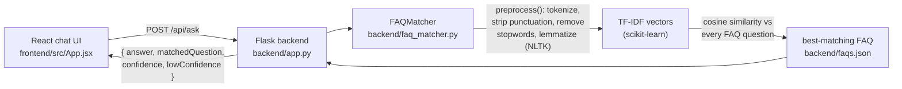

# Task 2 — Chatbot for FAQs

A React chat UI backed by a Flask API that matches user questions to a
fixed FAQ set using NLTK text preprocessing and TF-IDF + cosine
similarity — no external API, no key, fully self-contained.

## Architecture



Everything runs locally — no external translation/AI service, no API key,
nothing to sign up for.

## Requirement → file mapping

| Requirement | Implemented in |
|---|---|
| Collect FAQs related to a topic or product (questions and answers) | `backend/faqs.json` (28 Q&A pairs across Orders, Shipping, Returns, Payments, Account, Product) |
| Preprocess the text using NLP libraries like NLTK or SpaCy (tokenize, clean, etc.) | `backend/faq_matcher.py` → `preprocess()`: lowercase, strip punctuation, tokenize, remove stopwords, lemmatize (NLTK) |
| Match user questions with the most similar FAQ using cosine similarity or intent matching | `backend/faq_matcher.py` → `FAQMatcher`: TF-IDF vectors (scikit-learn) + `cosine_similarity` |
| Display the best matching answer as a chatbot response | `frontend/src/App.jsx` (chat message list) ← `frontend/src/api/ask.js` ← `POST /api/ask` ← `backend/app.py` |
| Optional: simple chat UI | `frontend/src/App.jsx` — full chat interface: message bubbles, suggested-question chips, typing indicator, low-confidence warnings |

## Setup

### 1. Backend

```bash
cd backend
python -m venv venv
source venv/bin/activate        # Windows: venv\Scripts\activate
pip install -r requirements.txt
python app.py
```

The first run downloads NLTK's tokenizer/stopwords/lemmatizer data
automatically (a few MB, one-time) — no manual `nltk.download()` step
needed. The API is now live at `http://localhost:5000`.

### 2. Frontend

```bash
cd frontend
npm install
cp .env.example .env   # only needed if the backend isn't on localhost:5000
npm run dev
```

Open the URL Vite prints (typically `http://localhost:5173`).

## How matching works

1. **Preprocessing** (`preprocess()` in `faq_matcher.py`): lowercase the
   text, strip punctuation, tokenize with NLTK's `word_tokenize`, drop
   English stopwords ("the", "is", "a"...), then lemmatize each remaining
   word to its base form (so "shipping"/"shipped"/"ships" all collapse to
   "ship").
2. **Vectorization**: every FAQ's question is preprocessed and converted
   to a TF-IDF vector — a numeric representation weighting words by how
   distinctive they are across the FAQ set, not just how often they occur.
3. **Matching**: the user's question goes through the same preprocessing
   and vectorization, then `cosine_similarity` scores it against every FAQ
   question vector. The highest-scoring FAQ's answer is returned.
4. **Low-confidence handling**: if the best score is under `0.2`
   (`FAQMatcher.LOW_CONFIDENCE_THRESHOLD`), the UI shows an amber warning
   instead of presenting the answer as a confident match — this matters
   because TF-IDF matches on *word overlap*, not real understanding, so an
   oddly-phrased or out-of-scope question can otherwise get a wrong answer
   presented with false confidence.

## Notes

- **This is lexical matching, not semantic understanding.** "I want my
  money back" and "How do I return an item?" share very few words, so a
  vague enough phrasing can under-match even when a human would find it
  obvious — that's an inherent limit of TF-IDF, not a bug. The
  low-confidence flag is the safety net for exactly this case.
- **To use your own FAQ topic**: just replace the contents of
  `backend/faqs.json` — no code changes needed, the matcher rebuilds its
  vectors from whatever's in that file at startup.
- **A relatively easy quality upgrade**, if you want it later: add an
  `"alt_questions": [...]` list to each FAQ entry with a few alternate
  phrasings, and match against all of them per FAQ (taking the best
  score). This is the standard "training phrases" pattern real intent
  classifiers use, and it directly addresses the lexical-overlap
  limitation above.
- **To swap NLTK for spaCy**: see the comment at the top of
  `faq_matcher.py` — only `preprocess()` needs to change, nothing else.
