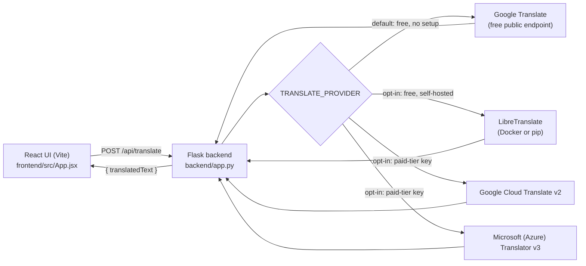

# Task 1 — Language Translation Tool

A React frontend and Flask backend that translate text between languages.
By default it uses Google Translate's **free public endpoint** — the same
one the Google Translate website itself calls — so there's nothing to
install and nothing to sign up for. LibreTranslate (self-hosted), Google
Cloud Translate, and Microsoft Translator are all also wired up as opt-in
alternatives.

## Architecture



The frontend never talks to any translation provider directly. If you
switch to Google Cloud or Azure, their API keys stay server-side — a paid
key must never ship in browser code, where anyone could read it out of the
network tab and spend your quota.

**Heads up about the default provider:** the free public endpoint isn't an
officially documented API — it's the same request the Google Translate
website makes internally. It requires no key and no account, but Google
can rate-limit or block it without notice since it's not meant for
programmatic use. That's a fine trade-off for a demo/portfolio project;
it's not something to depend on for production traffic.

## Requirement → file mapping

| Requirement | Implemented in |
|---|---|
| Create a UI where the user can enter text and select source & target languages | `frontend/src/App.jsx`, `frontend/src/components/LanguageSelect.jsx`, `frontend/src/components/TextPanel.jsx` |
| Use a translation API like Google Translate API or Microsoft Translator | `backend/app.py` (`translate_google_free` by default; `translate_libretranslate` / `translate_google` / `translate_azure` available via `TRANSLATE_PROVIDER`) |
| Send the text to the API and get the translated response | `frontend/src/api/translate.js` → `POST /api/translate` → `backend/app.py` |
| Display the translated text clearly on the screen | `frontend/src/App.jsx` (output `TextPanel`) |
| Optional: copy button / text-to-speech | `frontend/src/App.jsx` (`handleCopy`, `speak`, using the Clipboard and SpeechSynthesis Web APIs) |

## Setup

### 1. Backend

```bash
cd backend
python -m venv venv
source venv/bin/activate        # Windows: venv\Scripts\activate
pip install -r requirements.txt
cp .env.example .env
python app.py
```

The default `.env` already has `TRANSLATE_PROVIDER=google_free` — nothing
else to configure. The API is now live at `http://localhost:5000`.

### 2. Frontend

```bash
cd frontend
npm install
cp .env.example .env   # only needed if the backend isn't on localhost:5000
npm run dev
```

Open the URL Vite prints (typically `http://localhost:5173`).

That's it for the default setup — no accounts, no keys, no separate
service to run.

### Optional: switching to LibreTranslate (self-hosted, more stable than the free endpoint)

Needs [Docker](https://www.docker.com/products/docker-desktop/) installed
(on Windows, Docker is much less painful than a native `pip install` —
LibreTranslate's own docs recommend it).

```bash
docker run -d --name libretranslate -p 5001:5000 \
  libretranslate/libretranslate \
  --load-only ar,bn,zh,nl,en,fr,de,el,hi,id,it,ja,ko,ms,pl,pt,ru,es,sv,th,tr,uk,ur,vi
```

- `-p 5001:5000` maps it to port 5001 on your machine, so it doesn't
  collide with the Flask backend's own port 5000.
- `--load-only ...` restricts it to the languages this app's dropdown
  offers, so it downloads less and starts faster.
- First run downloads the language models (a few hundred MB to ~1-2GB)
  — one-time cost. `http://localhost:5001/languages` should return a JSON
  list once it's ready.
- Stop with `docker stop libretranslate`; restart with
  `docker start libretranslate` (no re-download needed).

Then in `backend/.env`, set `TRANSLATE_PROVIDER=libretranslate`.

### Optional: switching to Google Cloud Translate or Azure later

Both need a cloud account with a card on file for identity verification
(their free tiers themselves aren't billed, but account setup requires
one) — worth it if translation stability/quality on a specific language
pair matters more than staying account-free:

- **Google Cloud Translate**: enable the "Cloud Translation API" on a
  Google Cloud project, create an API key under
  *APIs & Services → Credentials*, set `TRANSLATE_PROVIDER=google` and
  `GOOGLE_TRANSLATE_API_KEY` in `backend/.env`.
- **Microsoft Translator**: create a *Translator* resource at
  portal.azure.com (pick the free **F0** pricing tier), copy its key and
  region from *Keys and Endpoint*, set `TRANSLATE_PROVIDER=azure` and
  `AZURE_TRANSLATOR_KEY` / `AZURE_TRANSLATOR_REGION` in `backend/.env`.

Nothing in the frontend needs to change for any of these.

## Notes

- The default provider is genuinely free with zero setup, but it's an
  unofficial endpoint — expect the occasional rate-limit or block,
  especially under repeated rapid testing. If that becomes disruptive,
  LibreTranslate is the next step up (still free, no card, just needs
  Docker running locally) and is more stable since you control the server.
- `MAX_CHARS` in `App.jsx` caps input length client-side to keep requests
  small and predictable; it's a UX choice, not something any provider here
  strictly requires.
- Switching providers is a one-line change in `backend/.env`
  (`TRANSLATE_PROVIDER=libretranslate` / `google` / `azure`). Nothing in
  the frontend needs to change.
